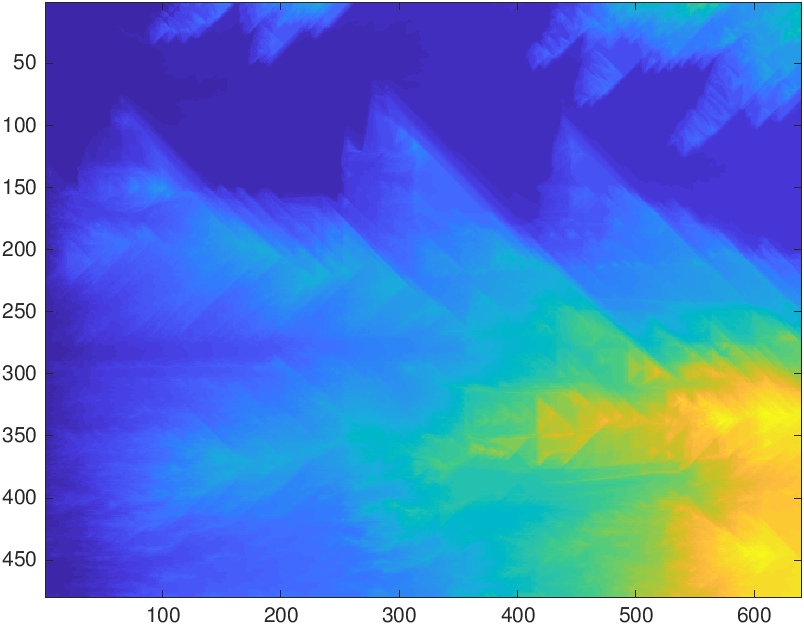

<h1 align='center' >Image Resizer</h1>

    
    
    

<h1></h1>

## Description

This image resizer uses a seam carving algorithm to decrease the the size of images
without loss of key features. As the name implies, seam carving algorithms selectively choose seams/lines
of contiguous pixels to remove. Seams are chosen based on how much energy they possess (essentially
a measure of how vital they are to the total image); The lower energy (less crucial) the better.
Vertical seams will be selected if the width of an image is to be decreased and horizontal seams will be chosen if
height is to be decreased.

## How it Works

The process of selecting a seam to remove is surprisingly mathematical and follows the following procedure.

### 1. Generate the Energy Image

In order to select a seam, a gradient is first applied to the base image to produce an energy image. The applied gradient
calculates the change in image intensity using derivative calculations. An example energy image looks like this:

<figure align='center'>
    
    <figcaption>
        Brighter colors indicate higher energy. Notice how edges are highlighted. This is because the greatest changes in image intensity/energy occur at these areas
    </figcaption>
</figure>

### 2. Generate the Minimum Cumulative Energy Image

Next, we need to modify the energy image to help us determine where our seam of lowest energy is. We do this by using our energy image to generate a minimum cumulative energy image. Each pixel in a minimum cumulative energy image represents the minimum amount of energy needed that get to that point.

If our goal is to reduce the height of an image, we will need to find a horizontal seam to remove. Therefore, we calculate the minimum cumulative energy of each pixel from left to right for each row in our energy image. 

If our goal is to reduce the width of an image, we will need to find a vertical seam to remove. Therefore, we calculate the minimum cumulative energy of each pixel from top to bottom for each column in our energy image. 

<figure align='center'>
    
    <figcaption>
        Horizontal minimum cumulative energy image. notice how high energy pixels are on the right of the image
    </figcaption>
</figure>

<figure align='center'>
    
    <figcaption>
        Vertical minimum cumulative energy image. notice how high energy pixels are on the bottom of the image
    </figcaption>
</figure> 

### 3. Find the Seam

Using our minimum cumulative energy image, we can now determine where the seam of lowest energy is located.

If we are trying to locate a horizontal seam, we iterate through the right-most column of pixels of our minimum cumulative energy image and find the pixel with the minimum cumulative energy. Then, starting from this minimum pixel, we find the path of least energy from right to left.

Conversely, if we are trying to locate a vertical seam, we iterate through the bottom-most row of pixels and find the pixel with the minimum cumulative energy. Then, starting from this minimum pixel, we find the path of least energy from bottom to top.

Chosen seams will look like this:
<figure align='center'>
    
    <figcaption>Example of a vertical seam (left) and horizontal seam (right) which have been chosen for removal</figcaption>
</figure>

Once we've found the seam of pixels, we simply remove them, thus resizing the image.

## How to Use

Try seam carving for yourself! Simply download the scripts in `./src` and run `seam_carving_decrease_width.m` or `seam_carving_decrease_height.m` to decrease the width or height of an image respectively. The scripts accept an image along with the amount of pixels you want to removed from the dimension of your choosing.